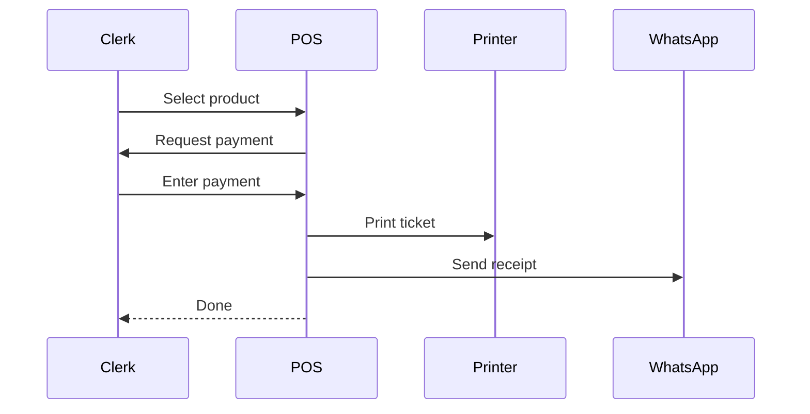
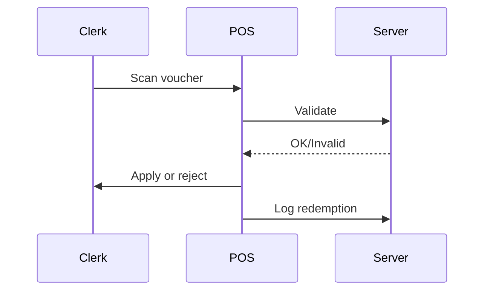
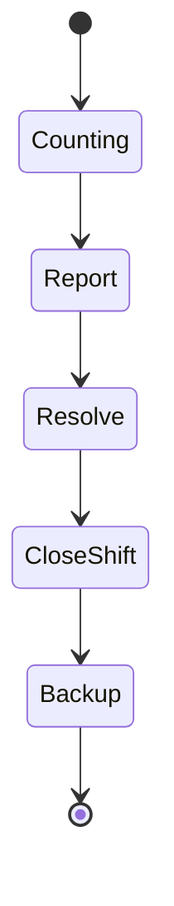
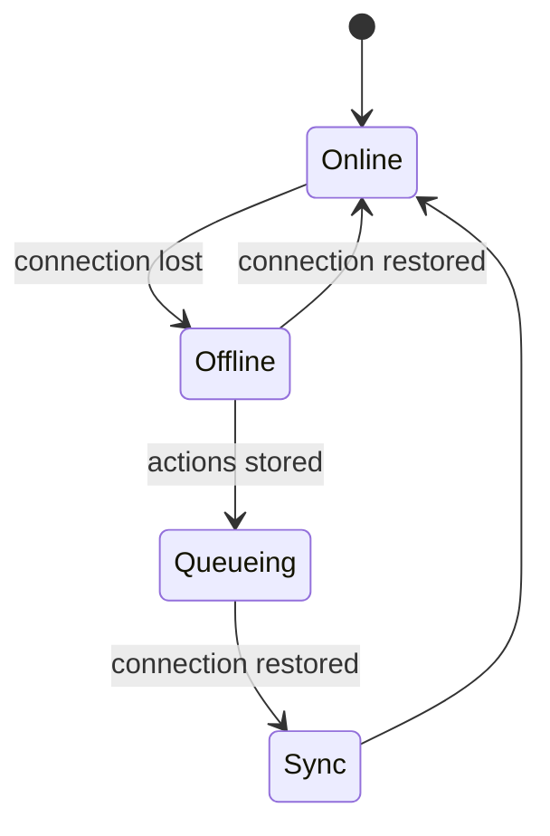

# Sequence & State Diagrams

## Issue Beach Access Ticket (Sequence)

```mermaid
sequenceDiagram
  participant C as Clerk
  participant POS
  participant Printer
  participant WhatsApp
  C->>POS: Select product
  POS->>C: Request payment
  C->>POS: Enter payment
  POS->>Printer: Print ticket
  POS->>WhatsApp: Send receipt
  POS-->>C: Done
```

## Redeem Voucher (Sequence)

```mermaid
sequenceDiagram
  participant C as Clerk
  participant POS
  participant Server
  C->>POS: Scan voucher
  POS->>Server: Validate
  Server-->>POS: OK/Invalid
  POS->>C: Apply or reject
  POS->>Server: Log redemption
```

## End-of-Day (State)

```mermaid
stateDiagram-v2
  [*] --> Counting
  Counting --> Report
  Report --> Resolve
  Resolve --> CloseShift
  CloseShift --> Backup
  Backup --> [*]
```

## Offline Mode (State)

```mermaid
stateDiagram-v2
  [*] --> Online
  Online --> Offline: connection lost
  Offline --> Online: connection restored
  Offline --> Queueing: actions stored
  Queueing --> Sync: connection restored
  Sync --> Online
```
